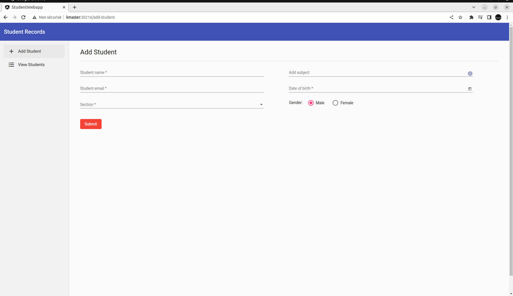

## Kubernetes

1. Installation

   1. Pré-requis
   
    Vous devez disposer de `vagrant` et de `virtualbox` sur votre machine.
    Vous pouvez suivre l'installation de vagrant  [ici](https://developer.hashicorp.com/vagrant/downloads).
    L'installation de virtuabox est disponible [ici](https://www.virtualbox.org/wiki/Linux_Downloads).

   2. Installation

    ```
        legeric@legeric-GF75-Thin-9SC ~$/dev/kubernetes cd install
        legeric@legeric-GF75-Thin-9SC ~$/dev/kubernetes vagrant up
    ```
    
    À la fin de l'installation, vous pouvez vérifier la présence des noeuds comme suivant : 
    
    1. Se connecter au noeud principal
    	
    	```
           legeric@legeric-GF75-Thin-9SC ~$/dev/kubernetes vagrant ssh kmaster
    	```
    
	2. Vérifier la présence des noeuds du cluster
	 
       ```
       vagrant@kmaster:~/student$ kubectl get nodes
	      NAME       STATUS   ROLES           AGE   VERSION
	      kmaster    Ready    control-plane   78d   v1.24.0
	      kworker1   Ready    <none>          78d   v1.24.0
	      kworker2   Ready    <none>          78d   v1.24.0
	      vagrant@kmaster:~/student$ kubectl get nodes -o wide
	      NAME       STATUS   ROLES           AGE   VERSION   INTERNAL-IP     EXTERNAL-IP   OS-IMAGE           KERNEL-VERSION      CONTAINER-RUNTIME
	      kmaster    Ready    control-plane   78d   v1.24.0   192.168.56.10   <none>        Ubuntu 22.04 LTS   5.15.0-33-generic   containerd://1.5.9-0ubuntu3
	      kworker1   Ready    <none>          78d   v1.24.0   192.168.56.11   <none>        Ubuntu 22.04 LTS   5.15.0-33-generic   containerd://1.5.9-0ubuntu3
	      kworker2   Ready    <none>          78d   v1.24.0   192.168.56.12   <none>        Ubuntu 22.04 LTS   5.15.0-33-generic   containerd://1.5.9-0ubuntu3
       ```
    		
2. Cas pratique : installation d'une application complète

    `student` est une application qui permet de réaliser des opérations de CRUD pour gérer des étudiants. 
    Elle est constitutée :
      - d'un frontend écrit en Angular 13, 
      - d'un backend exposant des APIs (Spring boot),
      - d'une base de données Postgres.
    
    Le frontend a été buidé dans un conteneur Docker disponible sur un registry privé (Gitlab).
    
    Il en est de même pour le backend (conteneur Docker buildé avec Maven-jib) disponible aussi sur un registry privé (Gitlab).
    
    Dans ce cas pratique, nous allons déployé l'application dans le cluster kubbernetes créé précédemment.
    
    Le déploiement se fera sur la base des fichiers de déploiements rédigés sous format YAML.
  
    1. Deployment Kubernetes
        
    Un déploiement Kubernetes est un objet de type ressource dans Kubernetes.
    Il fournit des mises à jour déclaratives pour les applications.
    Le déploiement permet de décrire le cycle de vie d'une application, en indiquant par exemple les images à utiliser, le nombre de pods à exécuter etc...
    Dans cet exemple, nous utiliserons des fichiers YAML pour décrire les déploiements de la base de données, du backend et du frontend.

    2. Installation de la base de données `postgres`

    Le déploiement de la base de données est décrit dans le fichier `student/postgres.yml`
    Il est constittué de plusieurs parties : 
    
     - La gestion des secrets
      
    ```
    ---
    apiVersion: v1
    kind: Secret
    metadata:
     name: db-secret
    type: Opaque
    data:
     username: YWRtaW4=
     password: YWRtaW4=
     appUsername: YWRtaW4=
     appPassword: YWRtaW4=
    ```
    	
      Dans la configuration ci-dessus, nous créons un objet `secret` de Kubernetes qui permet de stocker de façon confidentielle les informations sensibles telles que les mots de passe, les jetons OAuth, les clés SSH, etc.. 
      
      L'exemple ci-dessus permet de créer manuellement les informations secrètes converties en base64. Pour plus d'informations sur les différentes méthodes pour créer des secrets, consulter la [documentation officielle](https://kubernetes.io/fr/docs/concepts/configuration/secret/)
      
      - Le stockage des données
      
      Pour stocker les données de la base de données, nous allons définir un `PersistentVolume` (PV) et un `PersistentVolumeClaim` (PVC).
      
      Un PV est le volume physique dans le cluster qui va stocker les données persistantes. Il est comme un noeud, une ressource du cluster Kubernetes.
      
      Un PVC une demande de stockage. Le pod `postgres` consomme le PVC qui lui-même consomme le `PV` (Pod -> PVC -> PV).
      
     ```
        ---
        apiVersion: v1
        kind: PersistentVolume # Create a PV
        metadata:
          name: postgresql-data # Sets PV's name
          labels:
            type: local # Sets PV's type to local
        spec:
          storageClassName: manual
          capacity:
            storage: 100M # Sets PV Volume
          accessModes:
            - ReadWriteOnce
          persistentVolumeReclaimPolicy: Delete
          hostPath:
            path: "/mnt/data" # Sets the volume's path
        ---
        apiVersion: v1
        kind: PersistentVolumeClaim # Create PVC
        metadata:
          name: postgresql-data-claim # Sets name of PV
        spec:
          storageClassName: manual
          accessModes:
            - ReadWriteOnce # Sets read and write access
          resources:
            requests:
              storage: 100M # Sets volume size
     ```
      
      - Le déploieemnt de la base de données elle-même
      
      
   ```
	---
	# Create a deployment for postgresql
	apiVersion: apps/v1
	kind: Deployment
	metadata:
	  name: postgres-deployment
	  labels:
	    app: postgres
	spec:
	  selector:
	    matchLabels:
	      app: postgres
	  template:
	    metadata:
	      labels:
		app: postgres
	    spec:
	      containers:
	      - name: postgres
		image: postgres:latest
		env:
		  - name: POSTGRES_USER
		    valueFrom:
		      secretKeyRef:
		        name: db-secret
		        key: username
		  - name: POSTGRES_PASSWORD
		    valueFrom:
		      secretKeyRef:
		        name: db-secret
		        key: password
		  - name: POSTGRES_DB
		    value: student
		  - name: PGDATA
		    value: /var/lib/postgresql/data/pgdata
		ports:
		  - containerPort: 5432
		volumeMounts:
		    - mountPath: /var/lib/postgresql/data
		      name: postgresqldata
	      volumes:
		- name: postgresqldata
		  persistentVolumeClaim:
		    claimName: postgresql-data-claim
   ```
    	
   - Accès à la base de données via un service
      
   Un service est une collection de pods exposées à travers un endpoint.
   
   Dans un premier temps, nous avons besoin d'accéder à la bdd à l'intérieur du cluster (accès depuis le backend).
   
   La bdd sera exposé via un service de type `ClusterIP` sur le port 5432.
   
  ```
	---
	# Create a service for postgresql
	apiVersion: v1
	kind: Service
	metadata:
	 name: postgres-service
	spec:
	 selector:
	   app: postgres
	 type: ClusterIP
	 ports:
	 - name: postgres-port
	   port: 5432
	   targetPort: 5432
	   protocol: TCP
  ```

  3. Déploiement du backend `student-api`

      L'API est déployé avec une réécriture des paramètres d'accès à la base de données.
      
      Il pointe vers le service d'accès créé ci-dessus.
      
      Les credentials d'accès à la bdd sont lus dans le deployment `secret` défini ci-dessus.
      
      Enfin, l'API est exposé via le service ClusterIP `student-api-service`. C'est ce service que le pod du front utilisera pour accéder aux données
      
      
  ```
    ---
	# Create a deployment for postgresql
	apiVersion: apps/v1
	kind: Deployment
	metadata:
	  name: student-api-deployment
	  labels:
	    app: student-api
	spec:
	  selector:
	    matchLabels:
	      app: student-api
	  template:
	    metadata:
	      labels:
		app: student-api
	    spec:
	      containers:
	      - name: student-api
		image: registry.gitlab.com/legeric/student-api:latest
		env:
		  - name: SPRING_DATASOURCE_URL
		    value: jdbc:p6spy:postgresql://postgres-service:5432/student
		  - name: SPRING_DATASOURCE_USERNAME
		    valueFrom:
		      secretKeyRef:
		        name: db-secret
		        key: appUsername
		  - name: SPRING_DATASOURCE_PASSWORD
		    valueFrom:
		      secretKeyRef:
		        name: db-secret
		        key: appPassword
		ports:
		  - containerPort: 8080
		imagePullPolicy: Always
	      imagePullSecrets:
		- name: gitlab-registry-credentials
	---
	# Create a service for student-api
	apiVersion: v1
	kind: Service
	metadata:
	 name: student-api-service
	spec:
	 selector:
	   app: student-api
	 type: ClusterIP
	 ports:
	 - name: student-api-port
	   port: 8080
	   targetPort: 8080
	   protocol: TCP
   ```

  4. Déploiement du frontend `student-webapp`
      

  ```
  ---
	# Create a deployment for postgresql
	apiVersion: apps/v1
	kind: Deployment
	metadata:
	  name: student-webapp-deployment
	  labels:
	    app: student-webapp
	spec:
	  selector:
	    matchLabels:
	      app: student-webapp
	  template:
	    metadata:
	      labels:
		app: student-webapp
	    spec:
	      containers:
	      - name: student-webapp
		image: registry.gitlab.com/legeric/student-webapp:latest
		env:
		  - name: API_URL
		    value: http://student-api-service:8080
		ports:
		  - containerPort: 80
		imagePullPolicy: Always
	      imagePullSecrets:
		- name: gitlab-registry-credentials
	---
	# Create a service for student-webapp
	apiVersion: v1
	kind: Service
	metadata:
	 name: student-webapp-service
	spec:
	 selector:
	   app: student-webapp
	 type: NodePort
	 ports:
	 - name: student-webapp-port
	   port: 80
	   targetPort: 80
	   nodePort: 30216
	   protocol: TCP
  ```     

 5. Déploiement des manifestes
      
      Pour déployer les manifestes YAML décrits dans le sous-répertoire `student`, il faut lancer la commande ci-dessous : 
      
      ```
      vagrant@kmaster:~$ kubectl apply -f student/
      ```

     `kubectl apply` va exécuter les codes YAML contenus dans tous les fichiers du répertoire `student`.
     
      Voici le résultat ci-dessous : 
      

 ```
    secret/db-secret created
    persistentvolume/postgresql-data created
    persistentvolumeclaim/postgresql-data-claim created
    deployment.apps/postgres-deployment created
    service/postgres-service created
    deployment.apps/student-api-deployment created
    service/student-api-service created
    deployment.apps/student-webapp-deployment created
    service/student-webapp-service created
 ```

 Ensuite, pour connaître l'état des déploiement effectués, il faut utiliser la commande `kubectl get deployment -o wide` (l'option `-o wide` permet d'afficher plus d'informations)
      
  ```
     vagrant@kmaster:~$ kubectl get deployment -o wide
     NAME                        READY   UP-TO-DATE   AVAILABLE   AGE     CONTAINERS       IMAGES                                              SELECTOR
     postgres-deployment         1/1     1            1           4m57s   postgres         postgres:latest                                     app=postgres
     student-api-deployment      1/1     1            1           4m57s   student-api      registry.gitlab.com/legeric/student-api:latest      app=student-api
     student-webapp-deployment   1/1     1            1           4m57s   student-webapp   registry.gitlab.com/legeric/student-webapp:latest   app=student-webapp
  ```
      
  Ces déploiements ont créé des pods  : 
      
  ```
	vagrant@kmaster:~$ kubectl get pods -o wide
	NAME                                        READY   STATUS    RESTARTS      AGE     IP               NODE       NOMINATED NODE   READINESS GATES
	postgres-deployment-5cdbcb7858-bhh58        1/1     Running   0             7m57s   192.168.77.132   kworker2   <none>           <none>
	student-api-deployment-5bc678688c-cgldd     1/1     Running   0             7m57s   192.168.41.184   kworker1   <none>           <none>
	student-webapp-deployment-d66457cd9-6cjwm   1/1     Running   0             7m57s   192.168.41.185   kworker1   <none>           <none>
  ```

  
  On voit tous les pods ainsi que les noeuds sur lesquels ils sont exécutés.

  Les services qui exposent les accès aux applications sont aussi disponibles.
      
  ```
	vagrant@kmaster:~$ kubectl get svc -o wide
	NAME                     TYPE        CLUSTER-IP      EXTERNAL-IP   PORT(S)        AGE   SELECTOR
	kubernetes               ClusterIP   10.96.0.1       <none>        443/TCP        79d   <none>
	postgres-service         ClusterIP   10.100.26.217   <none>        5432/TCP       10m   app=postgres
	student-api-service      ClusterIP   10.96.46.104    <none>        8080/TCP       10m   app=student-api
	student-webapp-service   NodePort    10.103.185.18   <none>        80:30216/TCP   10m   app=student-webapp

  ```
      
   
      

 6. Quelques commandes Kubernetes à connaître  
  
  | Commande	        | Description|
  | ------------- :| ----------:|
  |`kubectl apply -f`| Appliquer le(s) fichier(s) YAML.|
  |`kubectl exec -it`| Se connecter à un conteneur Docker via un terminal interactive.|
  |`kubectl delete`| Supprimer une ressource.|
  |`kubectl delete -f`| Supprimer une ressource à partir d'un fichier.|
  |`kubectl get pods`| Liste des pods.|
  |`kubectl get pods -o wide`| Liste des pods avec des informations complémentaires.|
  |`kubectl describe pods`| Décrire tous les pods.|
  |`kubectl get svc -o wide`| Liste des services.|
  |`kubectl get deployment`| Liste des deployments.|
  |`kubectl get nodes`| Liste des noeuds.|
 
